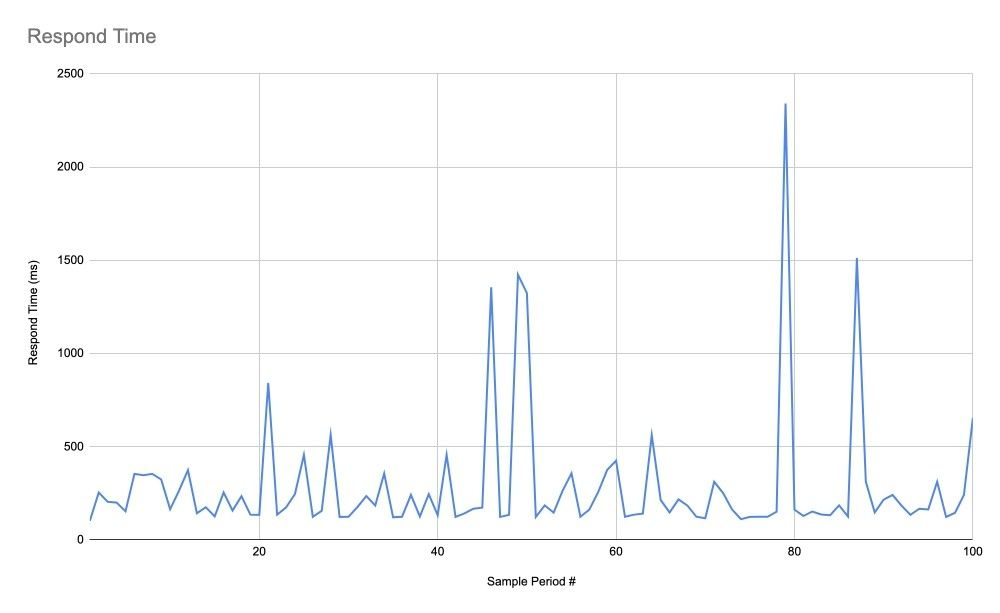
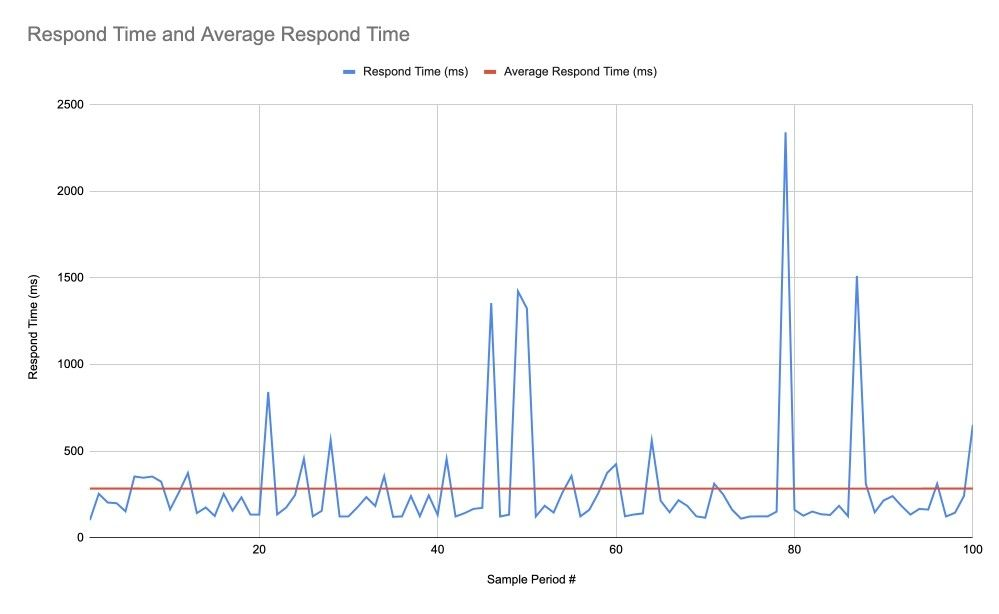
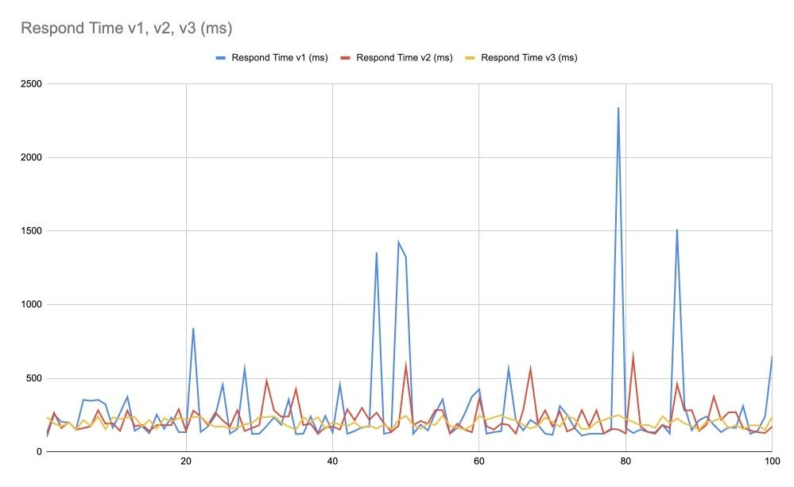
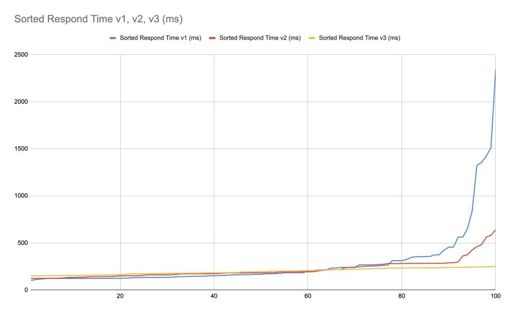
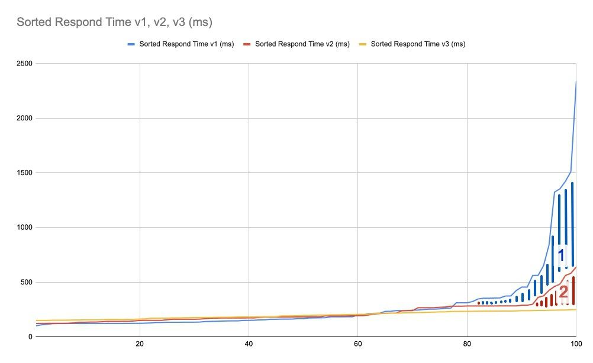
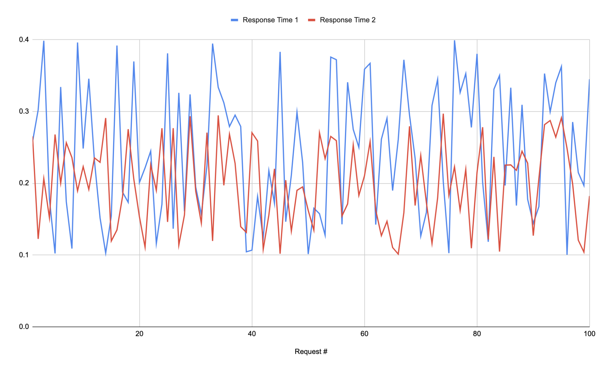
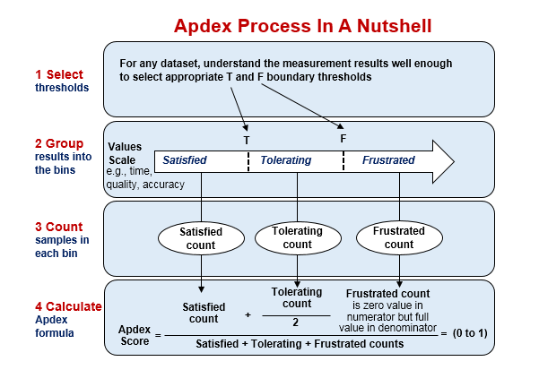

## General system performance
#### Books
  * [Systems Performance: Enterprise and the Cloud by Brendan Gregg (En)](http://www.brendangregg.com/sysperfbook.html)
  * [The Art of Application Performance Testing (En)](https://www.oreilly.com/library/view/the-art-of/9781491900536/)

#### Talks 
  * [От сервиса нагрузочного тестирования к центру компетенций Урал Нургалин (Rus)](https://www.youtube.com/watch?v=1ZGfN_uBpO8)
  * [Сложности performance-тестирования Андрей Акиньшин (Rus)](https://www.youtube.com/watch?v=am94iI2assY)   
  * [Честное перформанс-тестирование Дмитрий Пивоваров (Rus)](https://www.youtube.com/watch?v=8Mzs3arFGZo)  
  * [Бутылочное горлышко Михаил Епихин (Rus)](https://www.youtube.com/watch?v=5sAPrYmuMIs)  
  * [Учимся анализировать результаты нагрузочного тестирования Алексей Лавренюк (Rus)](https://www.youtube.com/watch?v=gws7L3EaeC0)  
  * [Вячеслав Смирнов — Ускоряем Apache JMeter (Rus)](https://www.youtube.com/watch?v=rQCspOA30Bc)
  * [Cloud Performance Root Cause Analysis at Netflix Brendan Gregg (En)](https://www.youtube.com/watch?v=03EC8uA30Pw)  
  * [Linux Performance Brendan Gregg (En)](https://www.youtube.com/watch?v=3jhl0v8MuDg)
  * [Подводные камни в нагрузочном тестировании — Владимир Ситников (Rus)](https://www.youtube.com/watch?v=3PWBBc7rZxw)
  * [Нагрузочное тестирование Atlassian Jira - Алексей Матвеев (Rus)](https://www.youtube.com/watch?v=cpXTUMxDFec)

#### Analyzing performance metods
  * [The USE Method](http://www.brendangregg.com/usemethod.html)
  * [The TSA Method](http://www.brendangregg.com/tsamethod.html)
  

## Java application performance
#### Books
   * [Optimizing Java: Practical Techniques for Improving JVM Application Performance (En)](http://shop.oreilly.com/product/0636920121718.do)

#### Talks
  * [Java Benchmarking: как два таймстампа прочитать! Алексей Шипилёв (Rus)](https://www.youtube.com/watch?v=8pMfUopQ9Es)
  * [Перформанс: Что В Имени Тебе Моём? Алексей Шипилёв (Rus)](https://www.youtube.com/watch?v=p2b4JHESEOc)
   
   
## Data analysis
#### Books
   * [Статистика и котики (Rus)](https://edgeconsult.me/lib/Math/Statistika_i_kotiki_Savelev.620655.pdf)
   
   
## База знаний нагрузочного тестирования
_Материал в процессе наполнения и редактирования_
#### Что такое нагрузочное тестирование?
 - [Глоссарий](#glossary)
 - [Введение в теорию НТ](#theory)
 - [Виды тестов](#test-types)
 - [Профиль нагрузки](#profile)
 - [Доклады по теме](#report-LT)
#### Разработка тестовых скриптов и заглушек
 - [Примеры скриптов Apache Jmeter](#jmeter-templates)
 - [Примеры скриптов Gatling](#gatling-tamplates)
 - [Плагины Apache JMeter](#jmeter-plugins)
#### Документация
#### Запуск тестов
#### Сбор и анализ метрик/логов
#### Генерация тестовых данных
#### Изучение работы системы
#### Настройка стенда
#### Инструменты нагрузочного тестирования
#### Мониторинг
#### Подготовка рабочего места
#### Автоматизация
 - [Доклады](#report-autotest)

### Что такое нагрузочное тестирование?
#### <a name="glossary"/>Глоссарий

- [ISTQB](https://www.rstqb.org/ru/istqb-downloads.html?file=files/content/rstqb/downloads/ISTQB%20Downloads/ISTQB_Glossary_English_v2.3.pdf) - англоязычный глоссарий терминов Iternation Software Testing Qualifications Board. К сожалению есть ряд спорных терминов и определений, которые либо не раскрывают суть, либо противоречат другим источникам. 
- [RSTQB](https://www.rstqb.org/ru/istqb-downloads.html?file=files/content/rstqb/downloads/ISTQB%20Downloads/ISTQB%20%D0%93%D0%BB%D0%BE%D1%81%D1%81%D0%B0%D1%80%D0%B8%D0%B8%CC%86%20%D0%A2%D0%B5%D1%80%D0%BC%D0%B8%D0%BD%D0%BE%D0%B2%20%D0%A2%D0%B5%D1%81%D1%82%D0%B8%D1%80%D0%BE%D0%B2%D0%B0%D0%BD%D0%B8%D1%8F%202.3.pdf) - аналогичный предыдущему русскоязычный глоссарий Russian Software Testing Qualifications Board

#### <a name="theory"/>Введение в теорию НТ

Нагрузочное тестирование (НТ) — тип тестирования, в котором мы проверяем, соответствует ли наша система поставленным
нефункциональным требованиям при работе под высокой нагрузкой.

По сравнению с функциональным тестированием, НТ сложнее чем просто тестирование, выдающее как результат успех/ошибка.
Оно намного сложнее и результаты — это множество метрик и графиков, которые должны быть проанализированы чтобы можно
было сделать вывод, насколько хорошо система работает в разных ситуациях.

##### <a name="what-is-needed"/>Что нужно для НТ

###### <a name="requirements"/>Требования

Требования должны быть максимально конкретны и покрывать множество ситуаций.

Пример плохого требования — «страницы должны загружаться быстро».

Пример хорошего требования — «_такая-то страница должна открывать быстрее чем за 100 мс для 75% случаев, быстрее 500 мс
для 95% случаев и быстрее 1 с для 99% случаев_».

###### <a name="people"/>Специалисты

Чем больше масштаб — тем сильнее разделение на более узкие специализации, но в общем для инженеров НТ было необходимо
иметь следующие роли:

1. QA — уметь искать проблемные места и выстраивать процесс обеспечения качества.
1. Аналитик — уметь выявлять причинно-следственные связи, исследовать паттерны поведения пользователей и разбираться в
   сложных системах.
1. Разработчик — уметь проектировать и программировать средства автоматизации и тестовые сценарии.
2. DevOps — уметь ориентироваться в архитектуре тестового окружения и модифицировать его.

###### <a name="tools"/>Инструменты

1. Генератор нагрузки: JMeter, Gatling, k6, Locust ….
1. Средства управления кластером (AWS API и подобное, собственные инструменты и т.д.).
1. Средства мониторинга и средства хранения и визуализации метрик и логов (Prometheus/InfluxDB + Grafana, ELK etc).
1. Средство для составления и место хранения отчётов.
1. Инструменты командной строки, электронные таблицы и т.д.

###### <a name="test-environment"/>Тестовое окружение

Тестовое окружение включает в себя:
1. Целевая система — должна быть как можно ближе к проду, а именно соответствовать его аппаратным ресурсам (CPU, RAM
   etc), базам данных (хотя бы по объёму etc)
1. Кластер подачи нагрузки — с размещёнными генераторами нагрузки и средствами мониторинга

##### <a name="stages"/>Этапы

1. Формулировка требований (что требуется от системы?).
1. Подготовка сценария (как будем воспроизводить проверяемое поведение пользователей и какие метрики приложения будем собирать?).
1. Подготовка тестового окружения (на чём будем тестировать и какие системные метрики будем собирать?).
1. Проведение теста и измерения (каковы значения собираемых метрик?).
1. Анализ (соответствует ли система требованиям, какие есть проблемы и что их вызывает?).
1. Отчёт (какие знания мы получили?).
1. План доработки системы* (как устранить проблемы?) — не всегда в компетенции НТ, лучше спросить функциональные команды
   или DevOps/SRE команду.

##### <a name="automation-stages"/>Этапы автоматизации

1. «Ручной» запуск (целевая система, тестовый сценарий и кластер подачи нагрузки запускаются вручную, результаты
   собираются вручную)
1. Тесты запускаются с минимальной автоматизацией (один скрипт/набор скриптов и целевую системы с кластером подачи
   нагрузки поднимают и сценарий запускают и результаты собирают).
1. Тесты вручную запускаются через веб интерфейс для определённой версии софта + создаётся красивый отчёт.
1. Интеграция в CI/CD.
1. Деградационные тесты.
1. Роботы делают всю рутину, люди сфокусированы только на по-настоящему сложных ситуациях более исследовательского
   характера: профилирование, хаос-тестинг и т.д.

#### <a name="metrics"/>Главные метрики и их анализ

Как было сказано во введении, мы должны собирать специфические для сценария и общие для системы метрики. Инженеры из
Google поделились своим опытом и описали [«4 золотых сигнала»](https://sre.google/sre-book/monitoring-distributed-systems/#xref_monitoring_golden-signals),
которые являются группами метрик, которые покрывают практически всё что нам нужно анализировать:

1. Латентность.
1. Трафик.
1. Ошибки.
1. Насыщенность.

Далее описаны эти типы метрик с дополнительными пояснениями для некоторых из них.

##### <a name="latency"/>Латентность

Это время обработки запроса, от момента отправки запроса клиентом до получения ответа им. Низкая латентность —
пользователь доволен. Латентность успешных запросов должна быть отделена от латентности ошибочных. Ошибки могут
возвращаться очень быстро (просто из-за потери соединения с базой данных например) и это может значительно влиять на
статистику. Медленные ошибочные запросы ещё хуже.

Эта метрика это то, что пользователь замечает в первую очередь (если система вообще доступа, хах), поэтому мы разберём
её немного более подробно.

###### <a name="mean-and-variance"/>Среднее и отклонения

От системы требуется быстро и правильно отвечать на запросы пользователей. И если правильность ответов скорее относится
к функциональному тестированию, скорость является как раз нашей заботой. Но «система должна отвечать быстро» — слабое
требование. Давайте разберёмся почему. Если мы посмотрим на этот график времени ответа ниже, мы не сможем сказать,
насколько быстро отвечает система при заданной нагрузке:

Мы можем проверить среднее время ответа, но если мы смотрим только на это среднее, мы можем сделать неверные выводы.
Например, на графике ниже среднее время ответа может быть вполне удовлетворительным для нас (284 мс), но это не говорит
нам ничего о скачках, которые существуют и могут быть критичны для нас:

Стандартное отклонение (или дисперсия == квадрат стандартного отклонения) может помочь нам. На следующем графике мы
видим среднее значение (красная линия) плюс (жёлтая линия) или минус (зелёная линия) стандартное отклонение. На самом
деле среднее значение минус стандартное отклонение в нашем случае отрицательное, но это не имеет смысла, поэтому эта
величина принимается за ноль.

Теперь мы видим некоторую оценку, говорящую нам о некоторой изменчивости. Но так же как среднее значение не очень
показательно, стандартное отклонение, являясь «усреднённой изменчивостью» не очень подходит для всех распределений
случайных величин. Оно хорошо для нормального распределения, но наше время ответов не обязательно является нормально
распределённым.

###### <a name="percentiles"/>Перцентили

Перцентили подходят значительно лучше. Но чтобы использовать их, нужно сформулировать несколько требований. Например,
50% запросов должны выполняться менее чем за 100 мс, 95% менее чем за 400 мс и 99% менее чем за 1 с. Ниже показан пример
графика, где отображены эти перцентили и можно увидеть, насколько время ответов соответствует требованиям, просто
сравнив значения процентилей с требуемым:

Как видно, перцентили больше чем в наших требованиях.

###### <a name="versions-comparison"/>Сравнение нескольких версий

Теперь предположим что мы сделали две оптимизированные версии. Сравним с изначальным графиком:

Глядя на график времени ответов мы конечно можем сказать, что красная линия v2 выглядит лучше чем синяя v1, а жёлтая
v3 выглядит лучше чем красная v2. Но нам нужно не просто примерно сказать что лучше, но определить это с уверенностью,
а лучше ещё и вычислить, насколько лучше. Для этого мы можем отсортировать времена ответов и получить такой график:

Этот график позволяет нам проще работать с процентилями. Обратите внимание, здесь у нас 100 замеров и поэтому мы можем
не агрегировать данные для перцентилей, но в реальном случае вам это понадобится.

Теперь мы явно можем сказать, что жёлтая линия v3 это лучший вариант, но насколько лучший? Чтобы ответить на этом, мы
можем посчитать (проинтегрировав значения точек графиков) площади, отмеченные «1» и «2» на графике ниже. Площадь «1»
показывает, насколько v2 лучше чем v1, площадь «2» — насколько v3 лучше v2, а сумма «1» и «2» — насколько v3 лучше v1.

###### <a name="apdex"/>APDEX

[APDEX](https://www.apdex.org/) (англ. Application Performance inDEX – индекс производительности приложения) — открытый
стандарт, который определяет метод для оценки и сравнения множества показателей от времени ответа приложения до качества
еды и многого другого.

Пример применения APDEX – автоматизированное сравнение результатов нескольких запусков тестов.

Представим, что у нас есть график времени ответа какого-нибудь эндпоинта. И есть график для второй версии алгоритма того
же эндпоинта. Посмотрим на них вместе:

Конечно вроде видно что красная линия лучше, но это видно человеку, а машине? Можно использовать перцентили, а можно
APDEX.

Вот схема его расчёта:

Примем следующую градацию:

1. удовлетворительное (satisfied) время: <=200 ms
1. терпимое (tolerating) время: <=300 ms
1. неудовлетворительное (frustrated) время: >300 ms

и применим к нашим данным.

Получится (поверьте):

1. Первая версия (синяя линия) – 0.525
1. Вторая версия (красная линия) – 0.75

APDEX уровни:

1. 0.00..0.50 — неприемлемо
1. 0.50..0.70 — неудовлетворительно
1. 0.70..0.85 — удовлетворительно
1. 0.85..0.94 — хорошо
1. 0.94..1.00 — отлично

Просто, измеримо, сравнимо. Не так просто интерпретировать как перцентили, но тем не менее.

##### <a name="traffic"/>Трафик

Для традиционных API трафик может быть измерен показателем числа запросов в секунду (англ. requests per second, RPS).
Высокий RPS (при низком времени ответа) — много довольных клиентов. Может быть полезным различать RPS статических и
динамических ресурсов. Для стриминговых систем можно мониторить частоту ввода/вывода и число параллельных сессий. Для
хранилищ ключ-значение — число транзакций и запросов в секунду.

##### <a name="errors"/>Ошибки

Очевидно, что мало ошибок — это хорошо (при низком времени ответа и объёмном трафике). Но коды протокола HTTP могут
быть недостаточны для выражения всех статусов. Например, HTTP-200 может быть выслан для ответа с неверным содержимым.
А HTTP-500 от балансировщика может быть как ошибкой балансировщика так и ошибкой на воркере и важно различать эти
ситуации. Хотя нагрузочное тестирование это не функциональное тестирование, всё равно может быть важно проверять
ситуацию глубже, чем просто смотреть на HTTP коды, чтобы убедиться что система не просто работает быстро, но и
корректно.

##### <a name="saturation"/>Насыщенность

Показывает, насколько «заполнены» ваши сервера и система в целом. К этому типу относится множество метрик, вот некоторые:

1. Загруженность CPU.
1. Количество свободной памяти.
1. Количество свободного места на диске.
1. Показатели ввода/вывода, в том числе сетевого.
1. Число использованных дескрипторов.
1. Количество серверов-воркеров.

#### <a name="glossary"/>Виды тестов

#### <a name="test-types"/>Профиль нагрузки 

#### <a name="report-LT"/>Доклады по теме

- [Нагрузочное тестирование с нуля - Кирилл Юрков](https://docs.google.com/presentation/d/1Vfw6_FIYxJxfsIW1-OFaj-SOmLZYUkJuM-k7wvcNhAE/edit?usp=sharing)

###  Разработка тестовых скриптов и заглушек

#### <a name="jmeter-templates"> Примеры скриптов Apache JMeter

#### <a name="gatling-tamplates"> Примеры скриптов Gatling

#### <a name="jmeter-templates"> Плагины Apache JMeter
- [JMeter Plugins](https://jmeter-plugins.org) - большая подборка плагинов для jmeter

### Документация

#### Методика нагрузочного тестирования (МНТ)

#### Оформление отчета и инструкций

### Запуск тестов

### Сбор и анализ метрик/логов

### Генерация тестовых данных

### Изучение работы системы

### Настройка стенда

### Инструменты нагрузочного тестирования

### Мониторинг

### Подготовка рабочего места

### Автоматизация

#### <a name="report-autotest"> Доклады
- [Автоматизация НТ дешево и больно Кирилл Юрков](https://youtu.be/sEcudxQB62M?t=2863) - Jenkins, JMeter и Grafana
- [Готовый шаблон автоотчеты в JMeter + большой дашборд](https://github.com/kirillyu/jmeterReports) - Confluence, JMeter и Grafana тестовые тренды и переход к тесту по ссылке.
